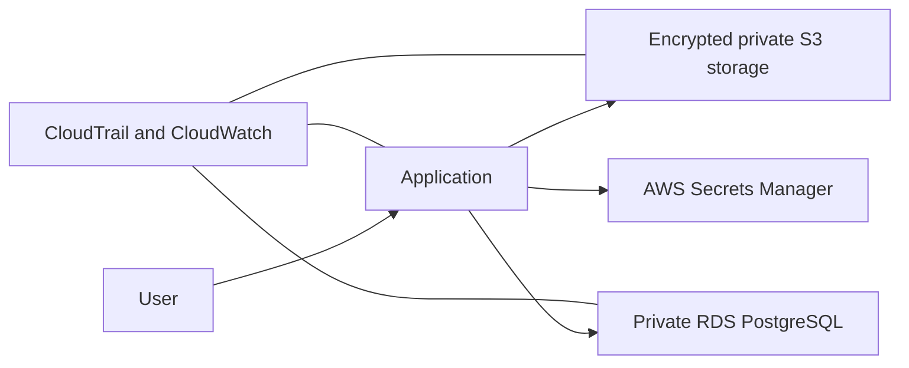
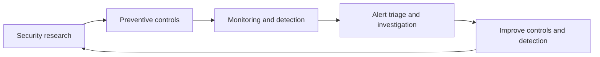

# Hi 👋, I'm Ismail Hassan

### Cloud Security & Information Security Engineer | Application Security | Security Operations

I am an information-security researcher and developer who enjoys understanding how systems fail, then building practical controls to make them safer. My work combines application-security research, cloud-security engineering, detection automation, and responsible vulnerability disclosure.

## Security Operations & Detection 🛡️

I enjoy the full security-operations workflow: turning raw security events into useful alerts, investigating suspicious behaviour, and improving detections over time. The projects below are practical Python examples of log monitoring and defensive automation.

| Project | Detection focus | What it demonstrates |
| --- | --- | --- |
| [Failed Login Detector](https://github.com/hasinosec/failed-login-detector) | Potential brute-force activity | Analyses authentication logs, groups failed attempts by source IP, and flags repeated failures within a configurable time window. |
| [File Integrity Monitor](https://github.com/hasinosec/file-integrity-monitor) | Unexpected file changes | Creates SHA-256 baselines and identifies monitored files that have been modified, added, or deleted. |

These projects relate to common SOC activities: alert analysis, detection logic, investigation of suspicious activity, and automation of repetitive checks.

### Failed Login Detection Flow

### File Integrity Monitoring Flow

## Cloud Security Engineering ☁️

I developed **File Vault**, a secure document-upload platform that models a small-company AWS architecture. The project is designed to demonstrate how security is built into cloud infrastructure: controlling identity access, protecting data, separating networks, securely managing secrets, and collecting audit evidence.

*This is a simplified view of how I designed File Vault to protect documents, isolate data services, manage secrets, and capture security-relevant activity. Account-specific infrastructure details remain private during the final security review.*

File Vault demonstrates:

- **Identity and access management:** least-privilege IAM roles and narrowly scoped permissions help ensure each service has only the access it needs.
- **Network security:** VPC segmentation and private data services reduce unnecessary exposure of the database and storage layer.
- **Data protection:** encrypted, versioned S3 storage with public-access blocking helps protect uploaded documents from accidental exposure or loss.
- **Secrets management:** database credentials are stored in AWS Secrets Manager instead of source code or configuration files.
- **Visibility and auditability:** CloudWatch and CloudTrail support monitoring, log collection, and investigation of important cloud activity.
- **Infrastructure as code:** Terraform makes the cloud configuration repeatable, reviewable, and easier to assess for security misconfigurations.
- **Security automation:** GitHub Actions, Checkov, and Trivy are used to support CI/CD checks and policy-as-code scanning before infrastructure changes are deployed.

## Security Research & Bug Bounty 🔍

I have reported and helped resolve 10+ vulnerabilities through public bug bounty and coordinated-disclosure programmes, including reports affecting Budibase, DataZone.co, Beefree.com, Amplitude, Weights & Biases, Greptile, and CodeRabbit. My goal is to help organisations understand, fix, and prevent security issues through clear, responsible reporting.

### Research Areas & Testing Methodologies

**Access control & authentication:** broken access control, IDOR, missing authentication for critical functions, privilege escalation, authentication bypass, JWT testing, and role-based access-control testing.

**Web & API security:** SQL injection, stored/reflected/DOM XSS, CSRF, SSRF, RCE, path traversal, deserialisation risks, XXE, HTTP request smuggling, and WebSocket security testing.

**Application logic & data protection:** business-logic flaws, race conditions, insecure password-reset flows, information disclosure, PII exposure, JavaScript analysis, and API abuse.

**Modern security research:** prompt-injection testing and AI-application security research, performed only within authorised scope.

### CVEs Assigned

| CVE | Advisory | Description |
| --- | --- | --- |
| [CVE-2026-25040](https://github.com/budibase/budibase/security/advisories/GHSA-4wfw-r86x-qxrm) | GHSA-4wfw-r86x-qxrm | Privilege Escalation via API Abuse — Creator Can Invite Users with Admin/Any Role |
| [CVE-2026-25045](https://github.com/budibase/budibase/security/advisories/GHSA-2g39-332f-68p9) | GHSA-2g39-332f-68p9 | Critical Privilege Escalation & IDOR via Missing RBAC on User Role Management (Creator-Role) |
| [CVE-2026-25043](https://github.com/budibase/budibase/security/advisories/GHSA-277c-prw2-rqgh) | GHSA-277c-prw2-rqgh | Unauthenticated Password Reset Endpoint Lacks Rate Limiting, Enabling Email Flooding |

Each CVE title above links to its official public GitHub Security Advisory. I do not publish proof-of-concept details that could put users or systems at risk.

## CTFs & Hands-On Security Learning 🎯

I use legal Capture The Flag (CTF) labs and learning environments to practise security skills safely. On [TryHackMe](https://tryhackme.com/p/Hasinosec), I work through hands-on challenges covering Linux, networking, web and API security, enumeration, vulnerability analysis, and privilege escalation.

CTFs help me understand how an attacker may discover and exploit weaknesses, while reinforcing the defensive controls needed to prevent them. I am currently ranked **#53 on TryHackMe's Nigeria all-time leaderboard** (rank at the time of this update).

## Featured Projects

- **File Vault** *(private while sanitising infrastructure information)* — Terraform-managed AWS document platform with private RDS, encrypted S3, least-privilege IAM, logging, and CI security checks.
- [Failed Login Detector](https://github.com/hasinosec/failed-login-detector) — Python-based security-monitoring tool that analyses authentication logs, identifies repeated failed-login activity by source IP, and flags potential brute-force behaviour within a configurable time window.
- [File Integrity Monitor](https://github.com/hasinosec/file-integrity-monitor) — Python SHA-256 monitor that reports modified, new, and deleted files.

## Security Approach

I approach security from both sides: understanding how vulnerabilities can be discovered and abused, then applying controls that make systems more resilient.

I am particularly interested in secure cloud architecture, API security, access control, monitoring, detection engineering, and incident response.

## Skills 🛠️

### ☁️ Cloud Security

AWS · IAM and least privilege · VPC and network segmentation · S3 encryption and public-access blocking · RDS security · AWS Secrets Manager · CloudTrail · CloudWatch · Terraform · policy as code · cloud-security posture management

### 🛡️ Security Operations & Detection

Security monitoring · log analysis · alert triage · threat hunting · incident response fundamentals · detection engineering · file-integrity monitoring · brute-force detection · vulnerability research

### 🔍 Application Security & Bug Bounty

OWASP Top 10 · OWASP API Security Top 10 · API testing · secure code review · SAST/DAST concepts · responsible disclosure · access-control testing · business-logic testing · web application penetration testing

### ⚙️ DevSecOps & CI/CD Security

GitHub Actions · infrastructure-as-code security · Checkov · Trivy · dependency and container-scanning concepts · security checks before deployment · secure configuration review

### 💻 Tools & Languages

Burp Suite · Python · JavaScript · Node.js · Terraform · Git · GitHub · AWS CLI

## Connect

- [LinkedIn](https://www.linkedin.com/in/ismail-h-1229a92a7/)
- [TryHackMe](https://tryhackme.com/p/Hasinosec)
