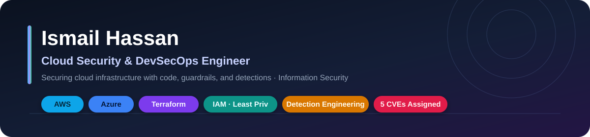
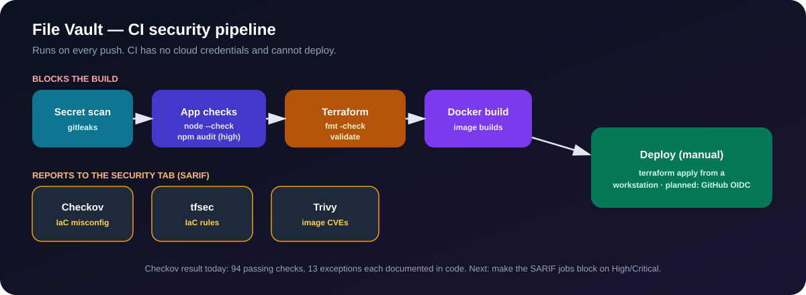
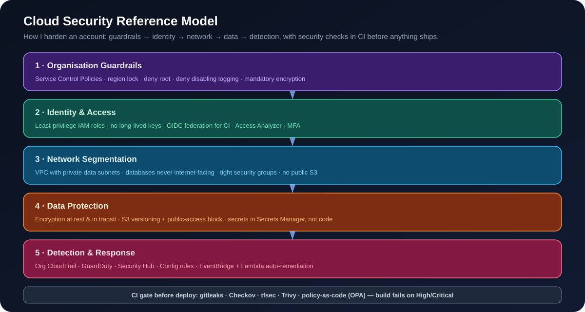
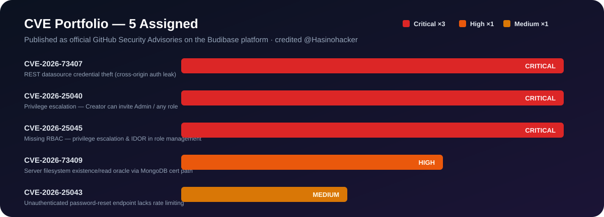
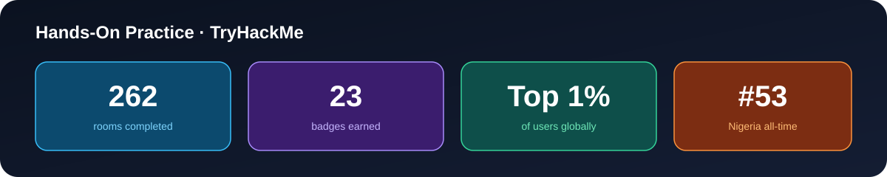
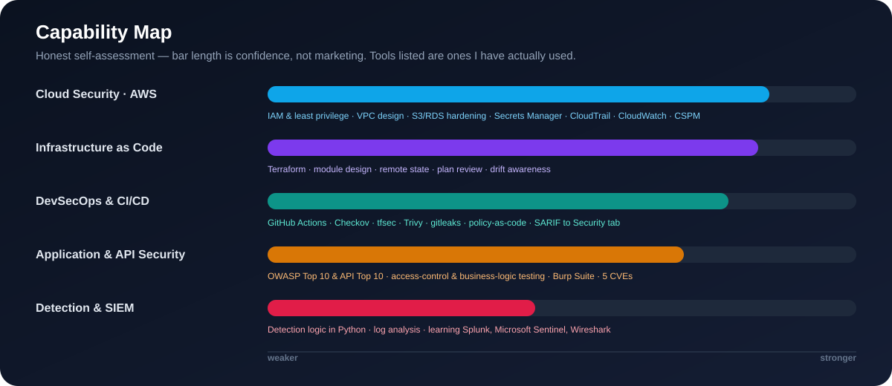

  

<h1 align="center">Ismail Hassan</h1>

<h3 align="center">Cloud Security &amp; DevSecOps Engineer&nbsp;|&nbsp;AWS &middot; Azure &middot; Terraform &middot; IAM &middot; Detection Engineering</h3>

## About

I build and secure cloud infrastructure with code — least-privilege identity, network
segmentation, data protection, security automation in CI, and detection. I started in
security research (5 assigned CVEs, valid bug bounty reports) and moved to building the
controls that stop those bugs.

Strongest on **AWS, Terraform, Docker, and Kubernetes**.
**Studying for:** Microsoft Certified: Cloud and AI Security Engineer Associate (SC-500).

**Reach me:** [LinkedIn](https://www.linkedin.com/in/ismail-h-1229a92a7/) · [Upwork](https://www.upwork.com/freelancers/~01e73f14f1161c7f0d) · manhasino@gmail.com

## How I approach a workload

1. Threat-model it — assets, trust boundaries, what an attacker gets.
2. Scope identity to least privilege; no long-lived keys.
3. Segment the network; keep data services private.
4. Encrypt data and move secrets into a vault.
5. Build it in Terraform so it is reviewable and repeatable.
6. Scan every change in CI (secrets, IaC, dependencies, image) before it ships.
7. Send logs to one place and write detections against them.

## Featured Projects

All of these have public code and CI.

### [File Vault](https://github.com/hasinosec/file-vault) — secure document platform on AWS

A document-upload service built the way a small company would build one: one web
server, a private database, secrets in a vault, everything in Terraform, security
scanning in CI. The app is deliberately small — the work is the infrastructure
around it. Full [architecture and threat model](https://github.com/hasinosec/file-vault/blob/main/THREAT_MODEL.md) in the repo.

- The EC2 role can reach one S3 bucket, one secret, and the CloudWatch agent. Nothing else.
- The database runs in private subnets. Only the app's security group can connect to it.
- S3 is encrypted with a KMS key I manage, versioned, all public access blocked, and a bucket policy rejects any non-TLS request.
- The database password is generated and held by Secrets Manager — never in code or Terraform state.
- The instance requires IMDSv2 and uses an encrypted root volume.
- Every push runs gitleaks, `terraform fmt`/`validate`, Checkov, Trivy (IaC and image), `npm audit`, and a Docker build.
- **Evidence:** ~25 resources across 8 Terraform files; 4 CI jobs on every push; Checkov reports 94 passing checks and 13 exceptions, each with a reason written in the code.

### [Container Security](https://github.com/hasinosec/container-security) — Docker hardening, with real before/after scans

Two Dockerfiles for the same app: a deliberately weak one and a hardened one,
with real Trivy and Hadolint results for both — nothing estimated.

- **9,314 → 183 vulnerabilities** (98% fewer), **232 → 3 Critical**
- **1.6 GB → 206 MB** image (multi-stage build, slim base)
- Root → non-root (uid 101), secret removed from the image, `HEALTHCHECK` added
- Documents a real bug hit while hardening it (missing `$HOME` broke `pip install --user`) and the 3 remaining Critical findings that have no upstream fix yet

### [Kubernetes Hardening Lab](https://github.com/hasinosec/k8s-hardening-lab) — real cluster, real admission control

A real local Kubernetes cluster, an insecure workload, and two independent
admission-control layers tested against it — everything is actual `kubectl`
output, not a diagram.

- Kubernetes' built-in Pod Security Admission genuinely rejects the insecure pod (0 pods ever created)
- 5 custom Kyverno policies independently block all 9 violations in the same manifest, and pass the hardened one cleanly
- Real kube-bench CIS run: **63 PASS / 12 FAIL / 56 WARN**, with every failure explained
- A real operational finding: the policies initially blocked kube-bench itself (it needs `hostPath` + root) — fixed with a narrow exception, not a blanket bypass
- Documents what *isn't* enforced here too — `kind`'s default CNI doesn't enforce NetworkPolicy — rather than staging a fake pass

### [Failed Login Detector](https://github.com/hasinosec/failed-login-detector)

Parses authentication logs, groups failed logins by source IP, and alerts when one IP
crosses a threshold inside a time window. Python, 8 tests, CI on 3.10–3.12. Maps to
MITRE ATT&CK T1110.

### [File Integrity Monitor](https://github.com/hasinosec/file-integrity-monitor)

Builds a SHA-256 baseline of a directory and reports files that were changed, added,
or removed, with severity. Python, 6 tests, CI.

## Cloud Security Model

How I harden a cloud account in layers, with the checks in CI so nothing insecure ships.

## Security Research

Five CVEs, all in the **Budibase** platform, all published as GitHub Security
Advisories and credited to [@Hasinohacker](https://github.com/Hasinohacker).

| CVE | Severity | Class | Summary | Advisory |
| --- | --- | --- | --- | --- |
| CVE-2026-73407 | Critical | Authentication | REST datasource credential theft via cross-origin auth leak | [GHSA-mqhr-6j6h-74p5](https://github.com/budibase/budibase/security/advisories/GHSA-mqhr-6j6h-74p5) |
| CVE-2026-25040 | Critical | Access control | Creator role can invite users with Admin or any role | [GHSA-4wfw-r86x-qxrm](https://github.com/budibase/budibase/security/advisories/GHSA-4wfw-r86x-qxrm) |
| CVE-2026-25045 | Critical | Access control | Missing RBAC — privilege escalation and IDOR in role management | [GHSA-2g39-332f-68p9](https://github.com/budibase/budibase/security/advisories/GHSA-2g39-332f-68p9) |
| CVE-2026-73409 | High | Server-side | Filesystem existence/read oracle via builder-controlled MongoDB cert path | [GHSA-ppr4-5f46-j9c6](https://github.com/budibase/budibase/security/advisories/GHSA-ppr4-5f46-j9c6) |
| CVE-2026-25043 | Medium | Rate limiting | Unauthenticated password-reset endpoint with no rate limiting | [GHSA-277c-prw2-rqgh](https://github.com/budibase/budibase/security/advisories/GHSA-277c-prw2-rqgh) |

**Bug bounty**

- [Bugcrowd](https://bugcrowd.com/h/ismailhacker) — 7 valid submissions, 77.78% accuracy. Focus: broken access control, IDOR, business-logic abuse. Hall of Fame: Amplitude.
- [HackerOne](https://hackerone.com/hasinohacker) — valid report and thanks from Weights & Biases.

## Hands-On Practice

262 [TryHackMe](https://tryhackme.com/p/Hasinosec) rooms across Linux, networking, web
and API security, enumeration, and privilege escalation. Top 1% of users; #53 on the
Nigeria all-time board. Completed Advent of Cyber 2024.

## Skills

- **Cloud (AWS):** IAM and least privilege, VPC and network segmentation, S3 and RDS hardening, KMS, Secrets Manager, CloudTrail, CloudWatch
- **Infrastructure as code:** Terraform — module design, remote state, plan review
- **DevSecOps:** GitHub Actions, Checkov, tfsec, Trivy, gitleaks, policy-as-code, dependency and container scanning
- **Application & API security:** OWASP Top 10 and API Security Top 10, access-control and business-logic testing, secure code review, Burp Suite
- **Languages:** Python, JavaScript and Node.js, Bash

**Also working with:** Azure (Entra ID, RBAC, PIM, Conditional Access, Key Vault, Azure Policy, Microsoft Sentinel / KQL), Kubernetes security, Splunk, Wireshark

## Roadmap

**Done** — File Vault on AWS · Docker hardening case study (98% fewer vulnerabilities) · [Kubernetes hardening lab](https://github.com/hasinosec/k8s-hardening-lab) (real cluster, Pod Security Admission + Kyverno, kube-bench CIS score) · two Python detection tools · 5 CVEs · security CI with Checkov/tfsec/Trivy/gitleaks

**In progress** — `aws-secure-baseline` (org guardrails, GuardDuty, Security Hub, Config, Prowler) · Terraform policy-as-code guardrail kit

**Planned** — cloud detection rules (CloudTrail) mapped to MITRE ATT&CK · cloud incident-response case study

## Education & Certifications

- **University of the People** — B.Sc. Computer Science, 2025–2027 (in progress)
- **Microsoft Certified: Cloud and AI Security Engineer Associate (SC-500)** — exam scheduled

## Connect

[LinkedIn](https://www.linkedin.com/in/ismail-h-1229a92a7/) &middot;
[TryHackMe](https://tryhackme.com/p/Hasinosec) &middot;
[HackerOne](https://hackerone.com/hasinohacker) &middot;
[Bugcrowd](https://bugcrowd.com/h/ismailhacker) &middot;
[Upwork](https://www.upwork.com/freelancers/~01e73f14f1161c7f0d)
