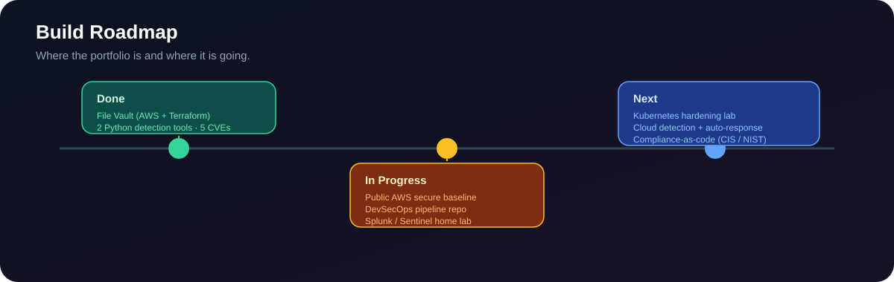

  

<h1 align="center">Hi, I'm Ismail Hassan</h1>

<h3 align="center">Cloud Security &amp; DevSecOps Engineer&nbsp;|&nbsp;AWS &middot; Azure &middot; Terraform &middot; IAM &middot; Detection Engineering&nbsp;|&nbsp;Information Security</h3>

I build and secure cloud infrastructure with code. My work covers least-privilege identity, network segmentation,
data protection, security automation in CI/CD, and detection engineering &mdash; backed by hands-on vulnerability
research and five assigned CVEs.

  
  
  
  
  
  

---

## Featured Projects

| Project | What it proves | Stack |
| --- | --- | --- |
| **[File Vault](https://github.com/hasinosec/file-vault)** &mdash; secure document platform on AWS | Security designed into cloud infrastructure: least-privilege IAM, private data services, encryption, secrets management, and audit logging &mdash; all as reviewable code | Terraform &middot; AWS &middot; Node.js &middot; GitHub Actions |
| **[Failed Login Detector](https://github.com/hasinosec/failed-login-detector)** | Detection logic for brute-force activity: parse auth logs, group failures by source IP, alert on a threshold within a time window | Python &middot; MITRE ATT&CK T1110 |
| **[File Integrity Monitor](https://github.com/hasinosec/file-integrity-monitor)** | File-integrity monitoring from first principles: SHA-256 baseline, then detect modified, new, and deleted files with severity | Python &middot; SHA-256 |
| **AWS Secure Baseline** &mdash; *in progress* | Account guardrails and posture management: SCPs, org CloudTrail, GuardDuty, Security Hub, Config rules, and a Prowler score report | Terraform &middot; AWS Organizations &middot; Prowler |

---

## Cloud Security &amp; DevSecOps

I harden a cloud account in layers, and I put the security checks in CI so nothing insecure ships.

**File Vault** puts this into practice:

- **Identity and access.** Least-privilege IAM roles scope every service to only the access it needs. No long-lived keys.
- **Network.** VPC segmentation keeps the database and file storage off the public internet.
- **Data protection.** S3 storage is encrypted, versioned, and blocks all public access.
- **Secrets.** Database credentials live in AWS Secrets Manager, never in source code or config.
- **Auditability.** CloudTrail and CloudWatch capture audit events and application logs for investigation.
- **Infrastructure as code.** Terraform makes the configuration repeatable, reviewable, and scannable for misconfiguration.
- **Security automation.** GitHub Actions runs Checkov, tfsec, Trivy, and gitleaks on every change; findings go to the Security tab and High/Critical fails the build.

---

## Security Research

Five CVEs assigned, all published as official GitHub Security Advisories on the **Budibase** platform and credited to **@Hasinohacker**.

| CVE | Severity | Issue | Advisory |
| --- | --- | --- | --- |
| **CVE-2026-73407** | Critical | Unauthenticated REST datasource credential theft via cross-origin auth leak | [GHSA-mqhr-6j6h-74p5](https://github.com/budibase/budibase/security/advisories/GHSA-mqhr-6j6h-74p5) |
| **CVE-2026-25040** | Critical | Privilege escalation &mdash; Creator role can invite users with Admin / any role | [GHSA-4wfw-r86x-qxrm](https://github.com/budibase/budibase/security/advisories/GHSA-4wfw-r86x-qxrm) |
| **CVE-2026-25045** | Critical | Missing RBAC &mdash; privilege escalation and IDOR in user-role management | [GHSA-2g39-332f-68p9](https://github.com/budibase/budibase/security/advisories/GHSA-2g39-332f-68p9) |
| **CVE-2026-73409** | High | Server filesystem existence/read oracle via builder-controlled MongoDB cert path | [GHSA-ppr4-5f46-j9c6](https://github.com/budibase/budibase/security/advisories/GHSA-ppr4-5f46-j9c6) |
| **CVE-2026-25043** | Medium | Unauthenticated password-reset endpoint lacks rate limiting (email flooding) | [GHSA-277c-prw2-rqgh](https://github.com/budibase/budibase/security/advisories/GHSA-277c-prw2-rqgh) |

Additional valid reports through coordinated disclosure:

- **[Bugcrowd &middot; @ismailhacker](https://bugcrowd.com/h/ismailhacker)** &mdash; 7 valid submissions (77.78% accuracy), mostly broken access control; **Amplitude** in the Hall of Fame.
- **[HackerOne &middot; @hasinohacker](https://hackerone.com/hasinohacker)** &mdash; valid report and thanks from **Weights &amp; Biases**.

Focus areas: broken access control, IDOR, privilege escalation, authentication bypass, SSRF, insecure password-reset flows, and business-logic abuse &mdash; tested only within authorised scope.

---

## Hands-On Practice

On [TryHackMe](https://tryhackme.com/p/Hasinosec) I have completed **262 rooms**, earned **23 badges**, reached the
**top 1%** of users, and rank **#53 on the Nigeria all-time leaderboard**. Labs cover Linux, networking, web and API
security, enumeration, exploitation, and privilege escalation. I also completed Advent of Cyber 2024 and the 7- and
30-day streak challenges.

---

## Roadmap

---

## Skills

**Proficient**

- **Cloud security (AWS):** IAM and least privilege, VPC and network segmentation, S3 and RDS hardening, AWS Secrets Manager, CloudTrail, CloudWatch, cloud security posture management
- **Infrastructure as code:** Terraform, module design, remote state, plan review
- **DevSecOps &amp; CI/CD:** GitHub Actions, Checkov, tfsec, Trivy, gitleaks, policy-as-code, dependency and container scanning
- **Application &amp; API security:** OWASP Top 10, OWASP API Security Top 10, access-control and business-logic testing, secure code review, Burp Suite
- **Languages &amp; tools:** Python, JavaScript / Node.js, Bash, Git, AWS CLI

**Learning / in progress**

- **Azure** cloud security
- **Detection &amp; SIEM:** Splunk, Microsoft Sentinel, Wireshark &mdash; in a legal home lab, on systems and traffic I own or am authorised to test
- **Kubernetes** security (hardening lab planned)

---

## Connect

[LinkedIn](https://www.linkedin.com/in/ismail-h-1229a92a7/) &middot;
[TryHackMe](https://tryhackme.com/p/Hasinosec) &middot;
[HackerOne](https://hackerone.com/hasinohacker) &middot;
[Bugcrowd](https://bugcrowd.com/h/ismailhacker) &middot;
[Upwork](https://www.upwork.com/freelancers/~01e73f14f1161c7f0d)
