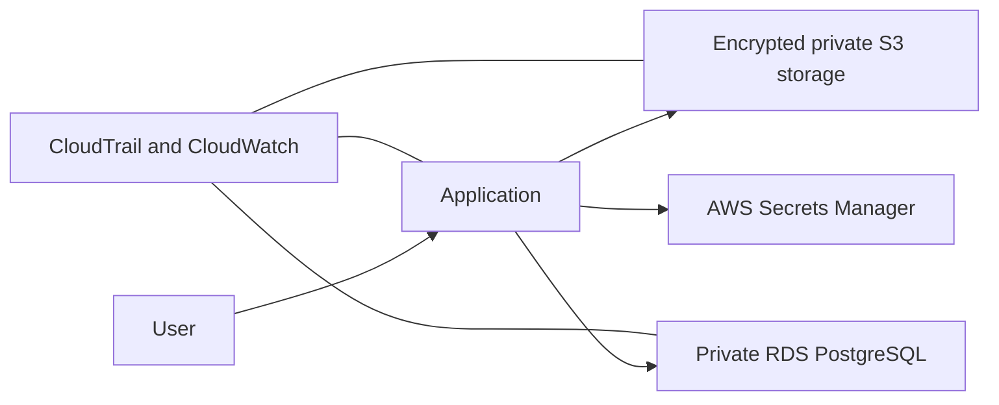
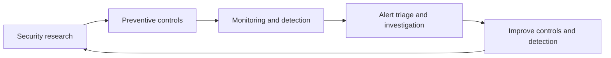

# Ismail Hassan

## Cloud Security & Information Security

I am an Information Security and Cloud Security engineer focused on security operations, cloud security, application security, and security engineering. I build hands-on security projects and use practical security research to understand threats and design controls that make systems more resilient.

## Security Operations & Detection

I am interested in the full security-operations workflow: collecting security events, identifying suspicious patterns, triaging alerts, and investigating the context needed for an informed response. The projects below are small, transparent examples of detection and monitoring automation written in Python.

| Project | Detection focus | What it demonstrates |
| --- | --- | --- |
| [Failed Login Detector](https://github.com/hasinosec/failed-login-detector) | Potential brute-force activity | Analyses authentication logs, groups failed attempts by source IP, and flags repeated failures within a configurable time window. |
| [File Integrity Monitor](https://github.com/hasinosec/file-integrity-monitor) | Unexpected file changes | Creates SHA-256 baselines and identifies monitored files that have been modified, added, or deleted. |

These projects relate to common SOC activities: alert analysis, detection logic, investigation of suspicious activity, and automation of repetitive checks.

### Failed Login Detection Flow

### File Integrity Monitoring Flow

## Cloud Security Engineering

I developed **File Vault**, a secure document-upload platform that models a small-company AWS architecture. The project is designed to demonstrate how security is built into cloud infrastructure: controlling identity access, protecting data, separating networks, securely managing secrets, and collecting audit evidence.

*Illustrative architecture diagram based on the File Vault project design. It is not an AWS Console screenshot and contains no account or infrastructure identifiers.*

File Vault demonstrates:

- **Identity and access management:** least-privilege IAM roles and narrowly scoped permissions help ensure each service has only the access it needs.
- **Network security:** VPC segmentation and private data services reduce unnecessary exposure of the database and storage layer.
- **Data protection:** encrypted, versioned S3 storage with public-access blocking helps protect uploaded documents from accidental exposure or loss.
- **Secrets management:** database credentials are stored in AWS Secrets Manager instead of source code or configuration files.
- **Visibility and auditability:** CloudWatch and CloudTrail support monitoring, log collection, and investigation of important cloud activity.
- **Infrastructure as code:** Terraform makes the cloud configuration repeatable, reviewable, and easier to assess for security misconfigurations.
- **Security automation:** GitHub Actions, Checkov, and Trivy are used to support CI/CD checks and policy-as-code scanning before infrastructure changes are deployed.

The File Vault repository is currently private while I review it for sensitive infrastructure details before sharing it publicly.

## Security Research & Bug Bounty

I have reported and helped resolve 10+ vulnerabilities through public bug bounty and coordinated-disclosure programmes, including reports affecting Budibase, DataZone.co, Beefree.com, Amplitude, Weights & Biases, Greptile, and CodeRabbit. My goal is to help organisations understand, fix, and prevent security issues through clear and responsible reporting.

Areas explored include:

- Broken access control and insecure direct object references (IDOR)
- Server-side request forgery (SSRF)
- Remote code execution (RCE)
- API and role-based access-control testing

### CVEs Assigned

| CVE | Advisory | Description |
| --- | --- | --- |
| [CVE-2026-25040](https://github.com/budibase/budibase/security/advisories/GHSA-4wfw-r86x-qxrm) | GHSA-4wfw-r86x-qxrm | Privilege Escalation via API Abuse — Creator Can Invite Users with Admin/Any Role |
| [CVE-2026-25045](https://github.com/budibase/budibase/security/advisories/GHSA-2g39-332f-68p9) | GHSA-2g39-332f-68p9 | Critical Privilege Escalation & IDOR via Missing RBAC on User Role Management (Creator-Role) |
| [CVE-2026-25043](https://github.com/budibase/budibase/security/advisories/GHSA-277c-prw2-rqgh) | GHSA-277c-prw2-rqgh | Unauthenticated Password Reset Endpoint Lacks Rate Limiting, Enabling Email Flooding |

Each CVE title above links to its official public GitHub Security Advisory. I do not publish proof-of-concept details that could put users or systems at risk.

## CTFs & Hands-On Security Learning

I use legal Capture The Flag (CTF) labs and learning environments to practise security skills safely. On [TryHackMe](https://tryhackme.com/p/Hasinosec), I work through hands-on challenges covering Linux, networking, web and API security, enumeration, vulnerability analysis, and privilege escalation.

CTFs help me understand how an attacker may discover and exploit weaknesses, while reinforcing the defensive controls needed to prevent them. I am currently ranked **#53 on TryHackMe's Nigeria all-time leaderboard** (rank at the time of this update).

## Featured Projects

- **File Vault** *(private while sanitising infrastructure information)* — Terraform-managed AWS document platform with private RDS, encrypted S3, least-privilege IAM, logging, and CI security checks.
- [Failed Login Detector](https://github.com/hasinosec/failed-login-detector) — Python-based security-monitoring tool that analyses authentication logs, identifies repeated failed-login activity by source IP, and flags potential brute-force behaviour within a configurable time window.
- [File Integrity Monitor](https://github.com/hasinosec/file-integrity-monitor) — Python SHA-256 monitor that reports modified, new, and deleted files.

## Security Approach

I approach security from both sides: understanding how vulnerabilities can be discovered and abused, then applying controls that make systems more resilient.

I am particularly interested in secure cloud architecture, API security, access control, monitoring, detection engineering, and incident response.

## Skills & Interests

**Security Operations:** security monitoring, alert analysis, threat hunting, incident response, and vulnerability research.

**Application Security:** OWASP Top 10, API Security Top 10, secure code review, SAST/DAST concepts, and coordinated vulnerability disclosure.

**Cloud Security:** AWS, IAM, Terraform, CloudTrail, CloudWatch, policy as code, and cloud-security posture management.

**Tools & Languages:** Burp Suite, GitHub Actions, Checkov, Trivy, Python, JavaScript, and Node.js.

## Connect

- [LinkedIn](https://www.linkedin.com/in/ismail-h-1229a92a7/)
- [TryHackMe](https://tryhackme.com/p/Hasinosec)
